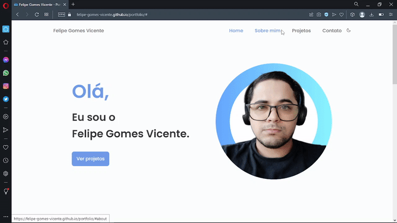

# Felipe Vicente

<h1 align="center">
    
</h1>

<br>

### 💻 Felipe Vicente - Portfolio

Build a portfolio landing page using NextJS and Tailwind CSS. 
The application created to display products digital and projects Front-end.

Watch it in action Deploy: [Click Here](https://felipe-gomes-vicente.netlify.app/)

What was developed:

- [x] Advancing in WEB Programming with Nextjs, Javascript and Typescript.
- [x] Style and format application with Tailwind CSS.
- [x] A README.md file with specifications on how to run the project in a dev environment.
- [x]  Give your functions and variables meaningful names: work with Clean Code concepts a bit.
- [x]  Routes.
- [x]  Props and components.
- [x]  hooks and context;
- [x]  Manipulating the DOM, Objects, Arrays and Events.
- [x]  Functions Callback.

## 🧪 Tools

Application developed using the following tools:

- [Next.js](https://nextjs.org/) project bootstrapped with [`create-next-app`](https://github.com/vercel/next.js/tree/canary/packages/create-next-app).
- [Tailwind CSS](https://tailwindcss.com/)

## 🚀 Getting started

Clone Project and access folder and start the server it is necessary to have nodeJs
installed and Visual Studio Code.

### Programs needed to Getting started

- [NodeJS version => 20.12.2](https://nodejs.org/en/)
- [Visual Studio Code - Vscode](https://code.visualstudio.com/)

Clone the project and access the folder

```bash
$ git clone https://github.com/felipe-gomes-vicente/portfolio-v1.git
$ cd portfolio-v1
```

## Getting Started

First, run the development server:

```bash
npm run dev
# or
yarn dev
# or
pnpm dev
# or
bun dev
```

Open [http://localhost:3000](http://localhost:3000) with your browser to see the result.


<p align="center">Done with 💜 by Felipe Vicente👋</p>

- ## My LinkedIn - [](https://www.linkedin.com/in/felipe-gomes-vicente/)