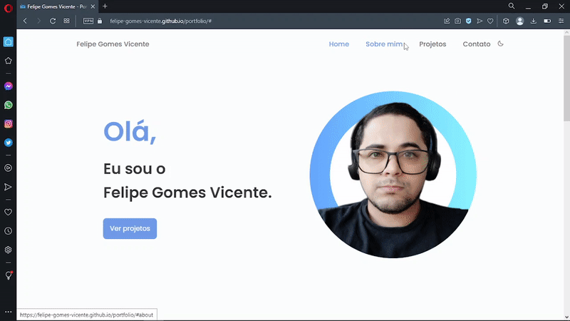
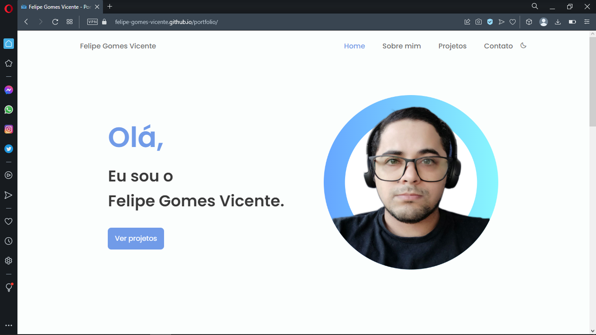
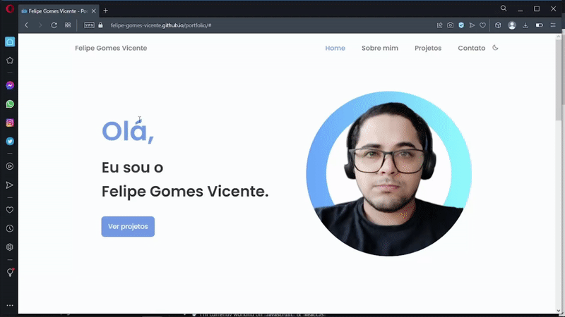

# Felipe Vicente

<h1 align="center">
    
</h1>

<br>

### 💻 Felipe Vicente - Portfolio

Build a portfolio landing page using HTML, CSS and programming language Javascript. 
The application created to display products digital and projects Front-end.

Watch it in action Deploy: [Click Here](https://felipe-gomes-vicente.github.io/portfolio/)

What was developed:

- Logic and Algorithms with Javascript;
- Mobile version and responsiveness;
- Manipulating the DOM;
- Functions Callback;
- Breakpoints with media query;
- Importing external CSS file into the project;
- Applying custom fonts (typography) in the CSS file and start the external CSS;
- Working with colors and fonts;
- Aligning and positioning text and elements;
- Applying spacing;
- Borders and classification of elements;
- CSS transitions;
- Use CSS variables to manipulate the project's color palette and font size;
- File system structure of the project separated by folder;
- Advancing in WEB Programming with Javacript;
- Javascript before the framework;
  
<br />

## Image from the final project:
 

 <br />

 <p>Portfolio Mobile</p>


## 🧪 Tools

Application developed using the following tools:

- [HTML5](https://www.w3schools.com/html/default.asp)
- [CSS3](https://www.w3schools.com/css/default.asp)
- [Javascript](https://developer.mozilla.org/pt-BR/docs/Web/JavaScript)
- [Lite server](https://github.com/johnpapa/lite-server)

## 🚀 Getting started

Clone Project and access folder and start the server it is necessary to have nodeJs
installed and Visual Studio Code.

### Programs needed to Getting started

- [NodeJS](https://nodejs.org/en/)
- [Live Server (Opcional)](https://marketplace.visualstudio.com/items?itemName=ritwickdey.LiveServer)
- [Visual Studio Code - Vscode](https://code.visualstudio.com/)

Clone the project and access the folder

```bash
$ git clone https://github.com/felipe-gomes-vicente/portfolio.git
$ cd portfolio
```

## 📝 License

This project is under the MIT license. See the file [LICENSE](LICENSE.md) for more details.

---

&nbsp;

<p align="center">Done with 💜 by Felipe Vicente👋</p>

- ## My LinkedIn - [](https://www.linkedin.com/in/felipe-gomes-vicente/)